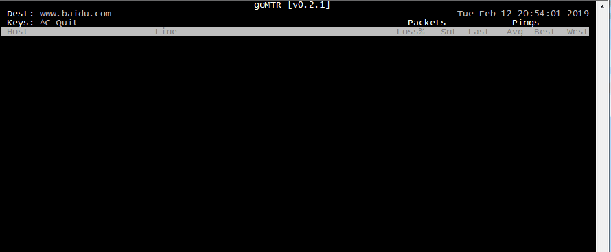

## Requirement
- ### go
 - go >= 1.8.5
 - arch amd64
- ### package
 - [github.com/PuerkitoBio/goquery](https://github.com/PuerkitoBio/goquery)
 - [github.com/axgle/mahonia](https://github.com/axgle/mahonia)


## Install
```
git clone https://github.com/xiaozhaoying/gomtr.git
go build gomtr.go
```


## Usage
```shell
./gomtr domain/IP
```

## Demo

